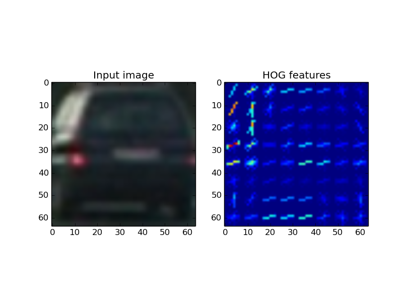
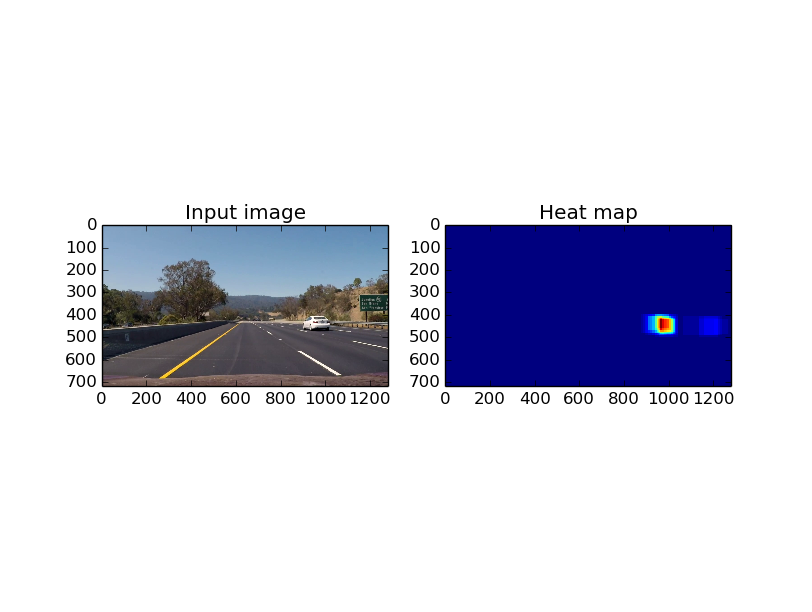

# AutoSentinel
**Vision based vehicle detector and tracker**

---

Following are the steps involved in accomplishing the task:
* Training the scaler and classifier
* Running inference on images

Note: Most of the comments mentioned here can be found in the code with the same heading. Hence not much reference has been pointed in the code. Main source file for this project is ["AutoSentinel_main.py"](./AutoSentinel_main.py)

### [Rubric](https://review.udacity.com/#!/rubrics/513/view) Points
### Details of blocks involved and corresponding Rubric:

### Feature selection and extraction [Rubric: Histogram of Oriented Gradients (HOG)]
For extracting HOG features, consider get_hog_features() API in ["AutoSentinel_main.py"](./AutoSentinel_main.py)
It used hog() API from skimage.features package. Parameters selected were: 

```
  color_space = 'YCrCb' # Can be RGB, HSV, LUV, HLS, YUV, YCrCb
  orient = 9  # HOG orientations
  pix_per_cell = 8 # HOG pixels per cell
  cell_per_block = 2 # HOG cells per block
  hog_channel = "ALL" # Can be 0, 1, 2, or "ALL"
  ```

"YCrCB" color space was chosen as HOG is known to perform well in this color space ["Reference"](http://ieeexplore.ieee.org/abstract/document/5651637/?reload=true). Other parameter namely orient, pix_per_cell, cell_per_block and hog_channel were chosen heuristically.

Apart from HOG features, spatial binning and histogram bins were also concatenated to form a feature vector. Spatial binning
scales down window of images to get a coarse signature of object features. Histogram binning gives similar features in color space. The parameters mentioned below were arrived at heuristically
```
  spatial_size = (16, 16) # Spatial binning dimensions
  hist_bins = 16    # Number of histogram bins
```
Complete feature vector contains spatial features, histogram features and HOG features stacked in the order mentioned and flattened.

### Training a classifier and scaler (Refer ["AutoSentinel_main.py"](./AutoSentinel_main.py) #33 to #175 and #380 to #441
* To evaluate if the classifier infrasture works fine, tests were conducted with only 1500 images each from both classes. 
* StandardScaler() was used to remove mean and scale to unit variance. This improves performance of the classifier. 
* Linear Support vector machine was used to classify the image input into 'vehicle' or 'non-vehicle' class.
* To train the classifier, all image file names were extracted using os.walk() API and after retreiving file names, features were extracted as they are explained above. extract_features() function does the task of converting color space, extracting spatial, histogram and HOG features and returning features for each class
* Extracted features are used for training a scaler and normalized data is then used to train the Linear SVM classifier(as mentioned in train_car_classifier())
* Once I had a confidence that infrastructre around the classifier is good, the training was executed for all images

### Rubric: Sliding Window Search (Refer ["AutoSentinel_main.py"](./AutoSentinel_main.py) #176 to #230

As mentioned above two approaches were taken to implement sliding window search
1) Scaled sliding window
  * Here the window size was initially set to (64,64) and increased by 8 evey row. Theory behind scaling this way was 'vehicles' far away from the camera are near the horizon and smaller in size. This would be taken care by windows of size (64, 64)
  * 'Vehicles' nearer to the camera would appear larger and still span part of the image starting from horizon
  * Scale and overlap parameters were chosen heuristically and set to (64, 64) with at least 40% overlap
  * Refer to the image ["Sliding scaled windows"](./debug/sliding_window_scaled_windows.jpg) for visualization of the sliding scaled windows
  
  
  
2) Constant size sliding window with scaled image
  * In this approach a constant sized sliding window is implemented and run over ROI part of the image. 
  * Window size was set to (64, 64) and overlap of 56 pixels between windows
  * With dynamic scaling of images, different sizes or vehicles can be detected with same window size
  * Refer to the image ["Scaled image constant sliding windows"](./debug/sliding_window_scaled_image.jpg) for visualization of the sliding constant windows on scaled image
  
  
  

### Training scaler and classifier
Steps involved:
 1. Read 'vehicle' and 'non-vehicle' data from respective folders ([data/vehicles](https://s3.amazonaws.com/udacity-sdc/Vehicle_Tracking/vehicles.zip) and [data/non-vehicles](https://s3.amazonaws.com/udacity-sdc/Vehicle_Tracking/non-vehicles.zip))
 
 
 Example image "Vehicle"
 
 
 
 Example image "Non-vehicle"
 
 2. Create a separate list of vehicle images and non-vehicle image filenames
 3. Run through all images in the list using extract_features() function and extract histogram, spatial and HOG features for all images
 Visualization of the HOG features is as follows
 
 
 "Vehicle" image with HOG features
 
 
 "Non-vehicle" image with HOG features
 
 4. Once all features are extracted, train a scaler which would help normalize features going ahead
 5. After the scaler is trained, pass all features through it to generate scaled features
 6. Train a classifier with the output of scaler. Input dataset is randomly split into training and testing set(20% the size of training set)
 7. Save the SVC classifer parameters and scaler parameters into a pickle file

When the code is executed, it checks if images are present and if classifier is already generated. If so, the training phase is skipped. This saves time during trials

### Running inference on images
Steps involved:
* Read input image
* Scale contents within range (0.0 to 1.0)
* Define ROI to remove regions where a vehicle can never be present (sky region/top region of image)
* From here on two approaches have been implemented in the code
 1. Slide scaled windows: In this approach windows are drawn through the ROI and features are computed on each window. Size of window increases as we go lower in the image
 2. Compute HOG features on entire scaled ROI image: Here we use relevant part of HOG features for a given sliding window. Only spatial and histogram parameters are computed for every window. Image is scaled instead of window parameters


One of these algos can be chosen with the help of global variable "USE_IMAGE_HOG". If "USE_IMAGE_HOG" is set to True, HOG on ROI (scaled image) would be executed
### Details of each approach:
#### Slide scaled windows:
1. Generate sliding windows with around 40% overlap and compute the pixels shifted ahead (pix_per_step) during every iteration
2. Once the first row is done, generate a bigger row now with width and height increased by pixel shift (pix_per_step) computed during the previous step
3. Continue and generate windows spanning entire ROI
4. Search on the windows defined in the previous steps using combination of spatial features, histogram features and HOG features. All these features are computed every time a bounding box needs to be searched and classified. This takes up a lot of time and the computations are redundant
5. The computed features on each window are scaled using a scaler and then passed to the Linear SVM classifier. Here we get an estimate which windows contain detected vehicle.
5. Once all the windows are classified as 'vehicle' and 'non-vehicle' we pass their parameters to the heat aggregator
6. Heat aggregator adds one at pixel positions where a vehicle was detected
7. After this step thresholding is applied to filter out noise and false positive detections
8. label() API from scipy.ndimage.measurements is used to mark different vehicles in the image depending on thresholded heat map
9. These labels represent vehicles present in the image

#### HOG on ROI (scaled image):
1. Scale ROI image depending on SCALE factor in the previous image
2. Convert ROI image into YCrCb as it is known to work better in this color space ["Reference"](http://ieeexplore.ieee.org/abstract/document/5651637/?reload=true)
3. Get HOG features for each color plane
4. Define windows to slide through ROI each of size (64, 64) shifting ahead 1 cell at a time (defined by pix_per_cell)
5. Retrieve feature vector using single_feat_vec() function. This API cuts window region from ROI, computes spatial and histogram features and appends part of the already computed HOG features flattened to the feature vector.
6. Computation of HOG features on every iteration is avoided using the technique.
7. Once the feature vectors are available scaler and SVM predictor are used in the same was as described above.
8. windows with 'vehicle' predictions are passed to the heat aggregator and HEAT_HISTORY is used to stabilize the output

### Heat History
1. Predictions of 'vehicles' are not very stable and there are false positives in the image. To overcome this problem, heat history is maintained for the last 5 images.
2. Evey time a heat map is available it replaces the stale heat map in the heat history
3. For all inferences, sum of heat history planes is taken along the depth axis to get a 2D heat map
4. Thresholding is applied on top of heat history sum plane
5. This tightens bounding boxes and also avoids spurious false positives

### Dynamic scaling of ROI
1. Scaling factor of ROI helps detect 'vehicles' far in the image (smaller size) or nearer to the camera (larger size)
2. To detect nearby vehicles, input image needs to be scaled down. This would allow classifier to infer better and get correct detections
3. 'vehicles' farther away from the camera would suffer if the image is scaled. To detect vehicles farther from camera, scaling factor should be 1 or lower
4. In the current implementation, scaling factor is controlled in the range (1.0 to 1.5)
5. If a vehicle is detected near the camera (bounding box of the vehicle is very close to the bottom most part of ROI), scaling factor is set closer to 1.5
6. If there are no vehicles nearby and some vehicles are getting detected farther ahead, scaling factor is set to 1.0. This allows dynamically detecting vehicles both in near field and far field

Heat map during vehicle detection is as shown below

 

### Dual heat thresholding
1. At times when the bounding boxes count over a 'vehicle' are less, heat map may have an entry but global thresholding would not count it in the final result since the overall threshold is high (around 13)
2. To avoid this situation and losing track of an already detected vehicle, the heat threshold is lowered by 4 if we have a valid detection in the image.

### Heat scaling
1. It could be seen that it takes 3-4 frames for a vehicle to be updated in output frame even when detection is positive in a given frame. This sluggish effect is caused due to heat history planes and higher threshold.
2. To avoid this situation and expedite getting noticed in heat history, heat aggregator scales the heat value to 1.8 instead of default 1. For all the vehicles detected in an image when there are no active detections, heat aggregator adds 1.8 to the heat map ( I call this "Heat hungry" phase as the algo takes in whatever minimum detections with higher importance)
3. Heat scaling is set back to 1.0 when at least one vehicle is detected in the image ( I call this "Heat content" phase; the algo knows it has enough to sustain a detection and need to worry less about excessive bounding boxes)
4. This fix allows faster recognition and dynamic control of heat update


#### Working of pipeline
  Please refer to section **Running inference on images** above for details

#### Performance optimization
Approach 1(sliding scaled windows) is slow as HOG features which are computationally intensive are computed for every frame and since there is an overlap between different frames a lot of this computation is redundant. To avoid unwanted computations, HOG features are computed once over entire image and then subsamples are taken into account while creating feature vectors. This improved the performance (execution speed) by at around 30%

### Video Implementation
  Video pipeline is the same as image pipeline except its run over the entire set of images in the video. Output of the execution could be found at 
["Execution video"](./output_project_video_all.avi)

### Bounding boxes drawn onto the input frame:


Describe how (and identify where in your code) you implemented some kind of filter for false positives and some method for combining overlapping bounding boxes
Following techniques were considered for making the algorithm robust. Please refer to the following sections mentioned above
1. **Dynamic scaling of ROI**
2. **Dual heat thresholding**
3. **Heat scaling**

### Discussion

#### Problems / issues faced while implementating the project
  HOG features are very sensitive to color space and it took time to read up and figure out that YCrCb color space would work best. Other problem I faced was with setting parameters for detecting 'vehicles' these parameters are sensitive and needed lots of experiments to finalize.
  
####  Pipeline failure scenarios and measures to make it robust
1. Pipeline could fail to work in dark/dim lighting conditions as HOG features would not be sharp in such scenarios. Neural network based approach could be considered to overcome this problem
2. The pipeline is very slow and if deployed in a real system could fail to work in real time deadlines. To solve this problem most of the implementation needs to be optimized and moved to a GPU. HOG feature computation kernel is available on GPU.
3. Another scenario where it could fail is when the vehicles are very far away. The window needs to be scaled to even lower sizes for detecting smaller vehicles. smaller windows however carry a trade-off of increased execution time
4. The pipeline could fail if the vehicle is too close to the camera. This would need training with data containing closer view of vehicles

---
